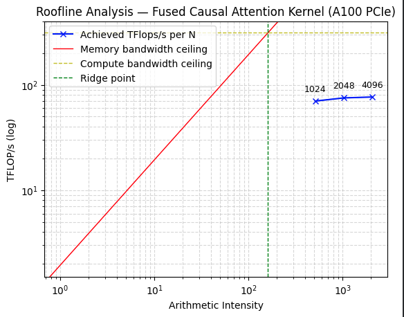
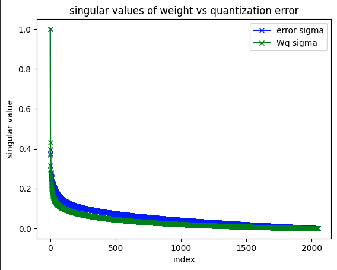

### LLM Inference Kernels

This repository consists of implementation and result analysis of kernel-level optimization techniques for LLM inference, including a fused causal attention kernel and an analysis of INT8 weight quantization.

#### Flash Attention

##### What is Flash Attention and Why is it required ?
The attention mechanism computes $softmax((Q K^T)/√d_k) V$.

For sequence length N, the NxN attention matrix requires O(N²) memory. At N=4096 with fp16, this is 32MB per head — far exceeding the ~200KB SRAM available per SM and has to be updated directly in VRAM. This constant round trip costs multiple GPU cycles and this memory traffic becomes the bottleneck, not arithmetic.

The online softmax introduced in https://arxiv.org/pdf/2205.14135 cuts down on the expensive round trips and introduces a tiled approach to attention layer. The accumulated intermediate result is constantly applied with corrections from newer tiles keeping intermediate results in SRAM throughout the computation, eliminating the O(N²) HBM traffic.

##### Mathematics of Online Softmax Correction

Standard numerically stable softmax subtracts the row maximum before exponentiation:

$$\text{Softmax}(x_i) = \frac{\exp(x_i - m)}{\sum_{j=0}^{N} \exp(x_j - m)}, \quad m = \max_k(x_k)$$

In a tiled computation, the true row maximum is unknown until all tiles are processed. When a new tile reveals a larger maximum $m'> m$, all previously accumulated exponentials must be corrected.

By the properties of exponentials:

$$\exp(x_i - m') = \exp(x_i - m) \cdot \exp(m - m')$$

where $\exp(x_i - m)$ is the value already accumulated and $\exp(m - m')$ is the correction factor applied retroactively. Since $m' > m$, the correction factor is less than 1, rescaling prior contributions downward.

The same correction applies to the running denominator:

$$\sum_j \exp(x_j - m') = \exp(m - m') \cdot \sum_j \exp(x_j - m) + \sum_{j \in \text{new tile}} \exp(x_j - m')$$

This allows softmax to be computed exactly over the full row while processing one tile at a time, never materializing the full $N \times N$ attention matrix in SRAM.

##### Algorithm

Define $B_r$ as the row block size, chosen such that $4 \times B_r \times d_k$ elements (tiles of $Q$, $K$, $V$, and the output accumulator) fit within SRAM.

Each thread block is assigned one $(batch, head)$ pair and is responsible for a $B_r \times d_k$ tile of the final attention output.

**Initialization**
- Allocate accumulator $O \in \mathbb{R}^{B_r \times d_k}$, running sum $\ell \in \mathbb{R}^{B_r}$, and running maximum $m \in \mathbb{R}^{B_r}$, all in registers.
- Load the assigned $Q$ tile of shape $B_r \times d_k$ into SRAM. This tile remains resident for the duration of the inner loop.

**Inner Loop** — iterate over all $\lceil N / B_r \rceil$ tiles of $K$ and $V$:

1. Load the current $K$ and $V$ tiles of shape $B_r \times d_k$ into SRAM.
2. Compute the scaled dot product $S = QK^T / \sqrt{d_k} \in \mathbb{R}^{B_r \times B_r}$.
3. Apply the causal mask: set $S_{ij} = -\infty$ for all key positions $j$ exceeding the query position $i$.
4. Compute the tile-local row maximum $m_{\text{new}} = \max(m,\ \text{rowmax}(S))$.
5. Compute the correction factor $\alpha = \exp(m - m_{\text{new}})$ and rescale: $O \leftarrow \alpha \cdot O$, $\ell \leftarrow \alpha \cdot \ell$.
6. Update the running maximum: $m \leftarrow m_{\text{new}}$.
7. Compute $P = \exp(S - m)$ and accumulate: $O \leftarrow O + P V$, $\ell \leftarrow \ell + \text{rowsum}(P)$.

**Finalization**
- Normalize: $O \leftarrow O / \ell$.
- Write the $B_r \times d_k$ output tile to HBM in a single store operation.

##### Hardware Specification and Execution

A PyTorch implementation of standard attention was used as correctness reference.
The Flash Attention was implemented in Triton and was tested with different configurations.

The above algorithm was tested on Hyak cluster with [NVIDIA A100 GPU](https://www.nvidia.com/en-us/data-center/a100/).

Triton's built benchmarking was used to test the performance of the kernel.

##### Benchmark Results

The following configurations were tested with batch size, embedding dimension, and number of heads fixed at $B=2$, $d=4096$, and $H=32$ respectively, giving $d_k = d/H = 128$. Sequence length $N \in \{1024, 2048, 4096\}$ and block size $B_r \in \{32, 64, 128\}$ were swept across all combinations.

###### Timing Results

| $N$ | $B_r$ | Median Runtime (ms) |
|-----|-------|-------------------|
| 1024 | 32 | 0.490 |
| | 64 | 0.582 |
| | 128 | 10.843 |
| 2048 | 32 | 1.829 |
| | 64 | 2.159 |
| | 128 | 42.106 |
| 4096 | 32 | 7.177 |
| | 64 | 8.481 |
| | 128 | 166.648 |

Runtime scales as $O(N^2)$ with sequence length for $B_r \in \{32, 64\}$, consistent with the quadratic complexity of attention. However, $B_r = 128$ exhibits a severe performance regression — approximately 20× slower than $B_r = 32$ at equivalent $N$ — that cannot be explained by reduced HBM traffic alone.

###### Hardware Occupancy Analysis

Execution throughput on an SM is jointly constrained by two on-chip memory resources: SRAM (shared memory) and the register file. The per-thread-block requirements for this kernel are:

$$\text{SRAM} = 4 \times B_r \times d_k \times 2 \text{ bytes} \quad (Q, K, V, \text{output tiles})$$

$$\text{Registers} = B_r^2 \times 2 \text{ bytes} \quad (S = QK^T) + B_r^2 \times 4 \text{ bytes} \quad (\text{accumulator}) + 2 \times B_r \times 4 \text{ bytes} \quad (m, \ell)$$

The A100 provides 192 KB SRAM and 256 KB register file per SM. The maximum concurrent thread blocks per SM is determined by whichever resource is exhausted first:

| $B_r$ | SRAM / block | Reg / block | Max blocks (SRAM) | Max blocks (Reg) | Effective |
|-------|-------------|------------|------------------|-----------------|---------|
| 32 | 32 KB | 20 KB | 6 | 12 | 6 |
| 64 | 66 KB | 42 KB | 2 | 6 | 2 |
| 128 | 131 KB | 100 KB | 1 | 2 | 1 |

At $B_r = 128$, both constraints independently limit occupancy to 1 thread block per SM. Across 108 SMs on the A100 PCIe, this yields approximately 108 concurrent thread blocks — roughly 6× fewer than at $B_r = 32$. Combined with the quadratically larger $B_r \times B_r$ matmul per iteration and longer register dependency chains reducing instruction-level parallelism, the 20× runtime regression is fully explained. $B_r = 32$ is the optimal configuration for $d_k = 128$ on this architecture.

###### Arithmetic Intensity and Roofline Analysis

Arithmetic intensity measures the ratio of floating-point operations to bytes transferred between HBM and SRAM, characterizing whether a kernel is compute-bound or memory-bound.

$$\text{Arithmetic Intensity} = \frac{\text{FLOPs}}{\text{Bytes Moved}}$$

The two attention matmuls ($QK^T$ and the weighted sum with $V$) contribute $4 \times B \times H \times N^2 \times d_k$ FLOPs. The bytes moved consist of three input tensor reads ($Q$, $K$, $V$) and one output write, totaling $(3 \times B \times H \times N \times d_k + B \times N \times d) \times 2$ bytes.

| $N$ | FLOPs | Bytes Moved | Arithmetic Intensity (FLOP/byte) | Achieved TFLOP/s | % of Peak |
|-----|-------|------------|--------------------------------|-----------------|---------|
| 1024 | 34.4G | 67.1M | 512 | 70.1 | 22.5% |
| 2048 | 137.4G | 201.3M | 1024 | 75.1 | 24.1% |
| 4096 | 549.8G | 268.4M | 2048 | 76.6 | 24.6% |

*Figure 1: Roofline analysis of the fused causal attention kernel on A100 PCIe. All three operating points lie well past the ridge point (161 FLOP/byte), confirming the kernel is compute-bound across all tested sequence lengths. The gap between achieved TFLOP/s (~70–77) and the compute ceiling (312 TFLOP/s) represents optimization headroom addressable through software pipelining and improved warp occupancy.*

The A100 PCIe ridge point — the arithmetic intensity at which the kernel transitions from memory-bound to compute-bound — is:

$$\text{Ridge Point} = \frac{\text{Peak FP16 TFLOP/s}}{\text{Peak Memory Bandwidth}} = \frac{312 \text{ TFLOP/s}}{1935 \text{ GB/s}} \approx 161 \text{ FLOP/byte}$$

All tested configurations exceed the ridge point by a factor of 3–12×, confirming the kernel is firmly in the compute-bound regime. The fused tiling successfully eliminates the $O(N^2)$ HBM traffic of naive attention — the bottleneck is now tensor core utilization rather than memory bandwidth. The gap from ~24% of peak to theoretical maximum reflects suboptimal instruction-level parallelism and warp occupancy at $B_r = 32$, representing the headroom available through further optimization such as software pipelining and autotuning.

#### Quantization

##### What is Quantization and Why is it Required?

Quantization is a post-training compression technique that reduces the numerical precision of weight matrices to decrease memory footprint and improve memory bandwidth utilization during inference. A standard weight matrix stored in $\text{fp16}$ occupies 2 bytes per element. Casting to $\text{int8}$ reduces this to 1 byte per element, yielding a 50% reduction in memory bandwidth requirements for weight-bound operations.

##### RTN vs. Learned Quantization

Round-to-Nearest (RTN) is a naive, computationally efficient quantization scheme that independently maps each weight to its nearest representable integer value. This project implements RTN as a baseline and provides a spectral analysis of the resulting quantization error.

Learned quantization methods such as GPTQ employ second-order optimization via the inverse Hessian of a proxy loss to minimize quantization error. Rather than rounding weights independently, GPTQ quantizes weights sequentially, redistributing the rounding error of each quantized weight across the remaining unquantized weights via a Cholesky-factored Hessian update. This produces significantly lower quantization error at the cost of substantially greater computational complexity during the quantization procedure.

##### RTN Implementation

**Quantization** ($\text{fp16} \rightarrow \text{int8}$)

Given a weight matrix $W \in \mathbb{R}^{m \times n}$ in $\text{fp16}$:

1. Compute the per-row scale factor: $s_i = \max_j |W_{ij}| / 127$
2. Scale each row: $\hat{W}_{ij} = W_{ij} / s_i$
3. Round to nearest integer and cast: $W^q_{ij} = \text{round}(\hat{W}_{ij}).\text{to}(\text{int8})$

**Dequantization** ($\text{int8} \rightarrow \text{fp16}$)

1. Cast the quantized matrix to $\text{fp16}$: $\tilde{W}_{ij} = W^q_{ij}.\text{to}(\text{fp16})$
2. Rescale by the stored per-row scale factor: $\tilde{W}_{ij} \leftarrow \tilde{W}_{ij} \cdot s_i$

The quantization error is defined as $E = W - \tilde{W}$, capturing the information lost due to the finite resolution of the $\text{int8}$ representation.

##### Results and Analysis

The $W_q$ projection matrix from the first attention layer of a pretrained `meta-llama/Llama-3.2-1B` model was extracted and subjected to RTN quantization. Two analyses were performed: relative error norm and spectral decomposition.

###### Relative Error Norm

The Frobenius norm of a matrix $A \in \mathbb{R}^{m \times n}$ is defined as:

$$\|A\|_F = \sqrt{\sum_{i,j} A_{ij}^2}$$

The relative error norm measures the magnitude of the quantization error normalized by the magnitude of the original weight matrix:

$$\epsilon_{\text{rel}} = \frac{\|E\|_F}{\|W\|_F} = \frac{\|W - \tilde{W}\|_F}{\|W\|_F}$$

RTN quantization of $W_q$ yields $\epsilon_{\text{rel}} = 0.0175$, corresponding to a $1.75\%$ relative loss in weight fidelity.

###### Spectral Analysis of Quantization Error

While the relative error norm provides a scalar summary of quantization loss, a spectral analysis via Singular Value Decomposition (SVD) reveals the structural properties of the error matrix. Specifically, the singular value spectrum determines whether the error concentrates in a low-dimensional subspace — a necessary condition for low-rank correction methods such as LoRA to be effective.

Given the SVD $E = U \Sigma V^T$, the singular values $\sigma_1 \geq \sigma_2 \geq \cdots \geq \sigma_r$ characterize the energy distribution across orthogonal directions. A rapidly decaying spectrum indicates low-rank structure; a slowly decaying spectrum indicates the error is diffuse across all directions.

The normalized singular value spectra of $W$ and $E$ are plotted below, where each spectrum is divided by its leading singular value to enable direct comparison of decay rates.

The error spectrum exhibits a slower decay rate than the weight matrix spectrum, with significant energy persisting across all singular directions. This indicates that the RTN quantization error is not low-rank — it cannot be faithfully represented by a truncated SVD approximation of small rank.

This finding has a direct implication for low-rank correction methods: a LoRA adapter applied post-quantization would capture only the dominant components of $E$, leaving the diffuse residual error uncorrected. This is consistent with the motivation for methods such as QLoRA, which do not attempt to correct RTN error via low-rank adaptation but instead employ more sophisticated quantization schemes (NF4) specifically designed to minimize the spectral spread of the quantization error in the first place.