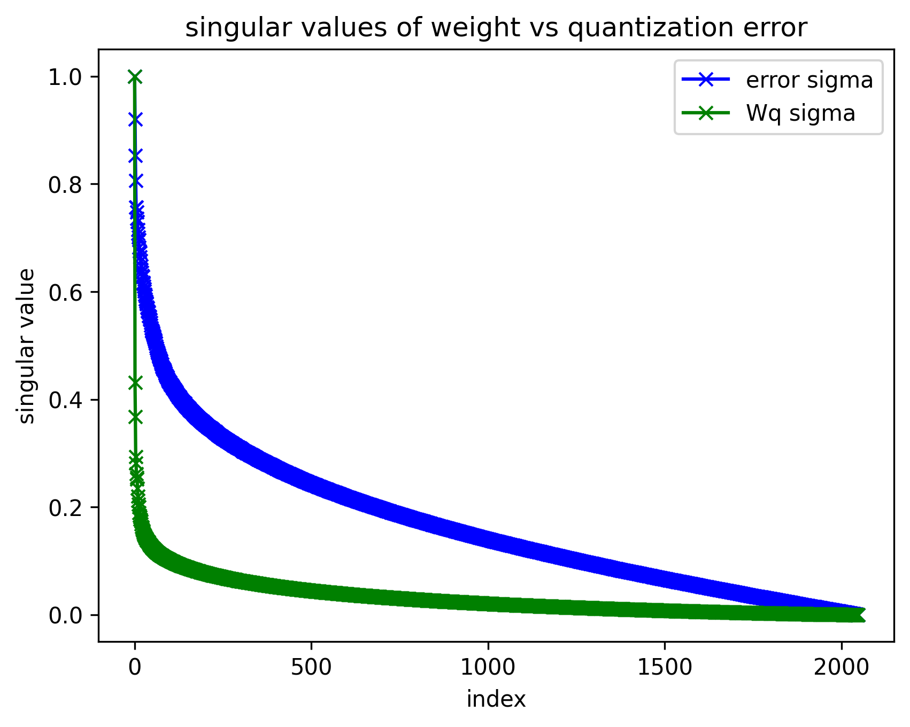

# Quantization

##### What is Quantization and Why is it Required?

Quantization is a post-training compression technique that reduces the numerical precision of weight matrices to decrease memory footprint and improve memory bandwidth utilization during inference. A standard weight matrix stored in $\text{fp16}$ occupies 2 bytes per element. Casting to $\text{int8}$ reduces this to 1 byte per element, yielding a 50% reduction in memory bandwidth requirements for weight-bound operations.

##### RTN vs. Learned Quantization

Round-to-Nearest (RTN) is a naive, computationally efficient quantization scheme that independently maps each weight to its nearest representable integer value. This project implements RTN as a baseline and provides a spectral analysis of the resulting quantization error.

Learned quantization methods such as GPTQ employ second-order optimization via the inverse Hessian of a proxy loss to minimize quantization error. Rather than rounding weights independently, GPTQ quantizes weights sequentially, redistributing the rounding error of each quantized weight across the remaining unquantized weights via a Cholesky-factored Hessian update. This produces significantly lower quantization error at the cost of substantially greater computational complexity during the quantization procedure.

##### RTN Implementation

**Quantization** ($\text{fp16} \rightarrow \text{int8}$)

Given a weight matrix $W \in \mathbb{R}^{m \times n}$ in $\text{fp16}$:

1. Compute the per-row scale factor: $s_i = \max_j |W_{ij}| / 127$
2. Scale each row: $\hat{W}_{ij} = W_{ij} / s_i$
3. Round to nearest integer and cast: $W^q_{ij} = \text{round}(\hat{W}_{ij}).\text{to}(\text{int8})$

**Dequantization** ($\text{int8} \rightarrow \text{fp16}$)

1. Cast the quantized matrix to $\text{fp16}$: $\tilde{W}_{ij} = W^q_{ij}.\text{to}(\text{fp16})$
2. Rescale by the stored per-row scale factor: $\tilde{W}_{ij} \leftarrow \tilde{W}_{ij} \cdot s_i$

The quantization error is defined as $E = W - \tilde{W}$, capturing the information lost due to the finite resolution of the $\text{int8}$ representation.

##### Results and Analysis

The $W_q$ projection matrix from the first attention layer of a pretrained `meta-llama/Llama-3.2-1B` model was extracted and subjected to RTN quantization. Two analyses were performed: relative error norm and spectral decomposition.

###### Relative Error Norm

The Frobenius norm of a matrix $A \in \mathbb{R}^{m \times n}$ is defined as:

$$\|A\|_F = \sqrt{\sum_{i,j} A_{ij}^2}$$

The relative error norm measures the magnitude of the quantization error normalized by the magnitude of the original weight matrix:

$$\epsilon_{\text{rel}} = \frac{\|E\|_F}{\|W\|_F} = \frac{\|W - \tilde{W}\|_F}{\|W\|_F}$$

RTN quantization of $W_q$ yields $\epsilon_{\text{rel}} = 0.0175$, corresponding to a $1.75\%$ relative loss in weight fidelity.

###### Spectral Analysis of Quantization Error

While the relative error norm provides a scalar summary of quantization loss, a spectral analysis via Singular Value Decomposition (SVD) reveals the structural properties of the error matrix. Specifically, the singular value spectrum determines whether the error concentrates in a low-dimensional subspace — a necessary condition for low-rank correction methods such as LoRA to be effective.

Given the SVD $E = U \Sigma V^T$, the singular values $\sigma_1 \geq \sigma_2 \geq \cdots \geq \sigma_r$ characterize the energy distribution across orthogonal directions. A rapidly decaying spectrum indicates low-rank structure; a slowly decaying spectrum indicates the error is diffuse across all directions.

The normalized singular value spectra of $W$ and $E$ are plotted below, where each spectrum is divided by its leading singular value to enable direct comparison of decay rates.

The error spectrum exhibits a slower decay rate than the weight matrix spectrum, with significant energy persisting across all singular directions. This indicates that the RTN quantization error is not low-rank — it cannot be faithfully represented by a truncated SVD approximation of small rank.

This finding has a direct implication for low-rank correction methods: a LoRA adapter applied post-quantization would capture only the dominant components of $E$, leaving the diffuse residual error uncorrected. This is consistent with the motivation for methods such as QLoRA, which do not attempt to correct RTN error via low-rank adaptation but instead employ more sophisticated quantization schemes (NF4) specifically designed to minimize the spectral spread of the quantization error in the first place.

###### Activation Anisotropy as an RTN Quantization Safety Diagnostic

Round-to-Nearest (RTN) activation quantization sets a single scale factor from the maximum absolute value in a tensor. When a small number of directions dominate a layer's activation matrix, that scale factor is set by those dominant directions, and the remaining structure is quantized with insufficient resolution. This project introduces a cheap, closed-form diagnostic for this failure mode using the ratio of the Frobenius norm to the spectral norm.
For an activation matrix X with n meaningful singular directions, this ratio is bounded between 1 (a single dominant direction — RTN unsafe) and √n (energy spread evenly across all directions — RTN safe). The diagnostic requires only a Frobenius norm and one power-iteration step to estimate the spectral norm, avoiding a full SVD.

Forward hooks were registered on the input to each attention QKV projection across all 16 layers of meta-llama/Llama-3.2-1B, capturing the activation matrix immediately before quantization would occur, on a 512–1157 token sample from WikiText-2. The diagnostic was validated independently in two inference runtimes:
In HuggingFace Transformers, the anisotropy score ranged from 2.01 at layer 0 to 1.78–1.86 in later layers, against a theoretical ceiling of √512 ≈ 22.6.

In vLLM, instrumented in single-process eager mode (VLLM_ENABLE_V1_MULTIPROCESSING=0, enforce_eager=True) with chunked prefill disabled to capture the full prompt in one forward pass, the same diagnostic on the same model produced scores of 2.01 at layer 0 settling to 1.79–1.96 in later layers, against a ceiling of √1157 ≈ 34.

Both runtimes converge on the same conclusion: Llama-3.2-1B's activations are consistently anisotropic across all layers, far below their respective theoretical safety ceilings. This confirms, independent of implementation, that naive per-tensor RTN activation quantization is unsafe across the entire model — consistent with why production quantization methods (SmoothQuant, AWQ) apply per-channel scaling rather than per-tensor RTN.

Instrumenting vLLM required two non-obvious fixes: disabling CUDA graph capture, since graph replay bypasses the PyTorch module call machinery that register_forward_hook depends on, and disabling chunked prefill, since vLLM's default prompt chunking caused hooks to fire on partial prefill segments rather than the full input sequence.
